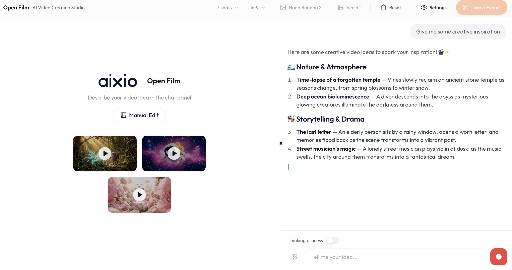
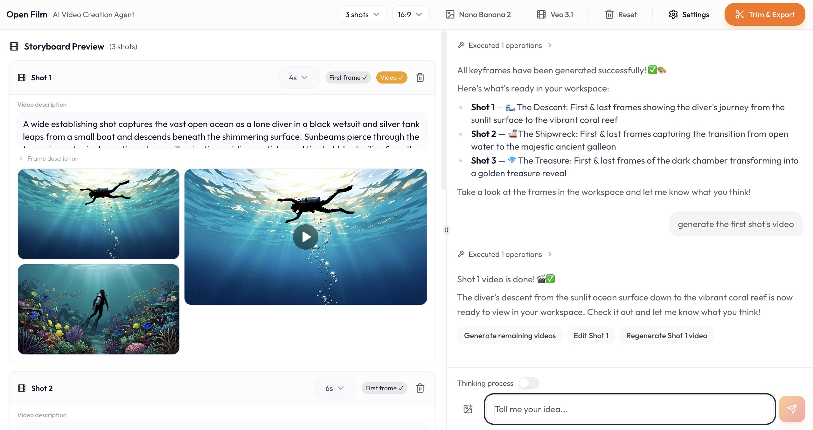
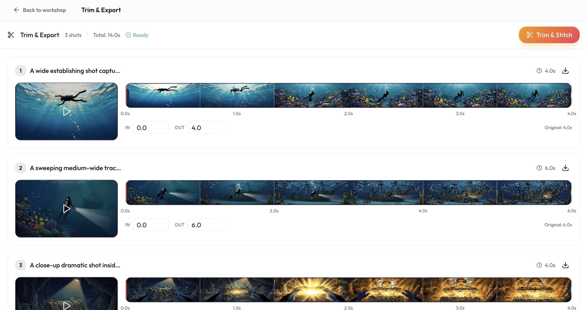

<div align="center">


# 🎬 OpenFilm — AI Video Creation Agent

### **Turn any idea into a cinematic video in minutes.**
### Just describe your vision. The agent handles everything else.

<br/>


</div>

---

## 🎥 Example Outputs

> *All videos below were created entirely by the agent — one prompt, no manual editing.*

<div align="center">👆 Click any thumbnail to watch the video</div>

<table>
<tr>
<td align="center" width="50%">
<a href="https://data.aixio.app/storage/v1/object/public/posts/dd439068-ae1a-4a57-985b-3ae000aad852/showcase-video-1773995189841.mp4" target="_blank" rel="noreferrer">

</a>
<br/><sub><b>3D Robot Animation</b></sub>
<br/><sub><i>Prompt: "Generate a 3D robot animation"</i></sub>
</td>
<td align="center" width="50%">
<a href="https://data.aixio.app/storage/v1/object/public/posts/dd439068-ae1a-4a57-985b-3ae000aad852/showcase-video-1773994552035.mp4" target="_blank" rel="noreferrer">

</a>
<br/><sub><b>Product Ad</b></sub>
<br/><sub><i>Prompt: "Generate an ad for this product"</i></sub>
</td>
</tr>
<tr>
<td align="center" width="50%">
<a href="https://data.aixio.app/storage/v1/object/public/posts/dd439068-ae1a-4a57-985b-3ae000aad852/showcase-video-1774720474318.mp4" target="_blank" rel="noreferrer">

</a>
<br/><sub><b>Product Ad</b></sub>
<br/><sub><i>Prompt: "Generate an ad for this product"</i></sub>
</td>
<td align="center" width="50%">
<a href="https://data.aixio.app/storage/v1/object/public/posts/dd439068-ae1a-4a57-985b-3ae000aad852/showcase-video-1773994371245.mp4" target="_blank" rel="noreferrer">

</a>
<br/><sub><b>Space Adventure</b></sub>
<br/><sub><i>Prompt: "Generate a cute 3D robot animation in space"</i></sub>
</td>
</tr>
<tr>
<td align="center" width="50%">
<a href="https://data.aixio.app/storage/v1/object/public/posts/dd439068-ae1a-4a57-985b-3ae000aad852/showcase-video-1774720471079.mp4" target="_blank" rel="noreferrer">

</a>
<br/><sub><b>Product Ad</b></sub>
<br/><sub><i>Prompt: "Generate an ad for this product"</i></sub>
</td>
<td align="center" width="50%">
<a href="https://data.aixio.app/storage/v1/object/public/posts/dd439068-ae1a-4a57-985b-3ae000aad852/showcase-video-1774717886436.mp4" target="_blank" rel="noreferrer">

</a>
<br/><sub><b>Ocean Adventure</b></sub>
<br/><sub><i>Prompt: "Generate a video about the adventure in the sea"</i></sub>
</td>
</tr>
</table>

---

## ✨ See It In Action

<table>
<tr>
<td align="center" width="50%">

<br/><sub><b>① Describe your idea</b></sub>
<br/><sub>Agent plans the storyboard instantly</sub>
</td>
<td align="center" width="50%">

<br/><sub><b>② Keyframes & videos generated</b></sub>
<br/><sub>Every shot, fully automated</sub>
</td>
</tr>
<tr>
<td align="center" width="50%">

<br/><sub><b>③ Trim, arrange & export</b></sub>
<br/><sub>Built-in timeline editor</sub>
</td>
<td></td>
</tr>
</table>

---

## 🚀 What Makes It Special

OpenFilm is built around a single vision: a **fully autonomous, end-to-end video creation agent**. You describe an idea — the agent handles the rest. From writing the script and designing the storyboard, to generating keyframes, synthesizing AI videos, and exporting the final cut — everything happens in one conversation, with no manual setup required.

We believe the future of video creation isn't a suite of disconnected tools. It's a single intelligent agent that understands your creative intent and executes the entire production pipeline for you.

---

## ⚡ Quick Start

**Prerequisites:** Node.js 18+, an [OpenRouter](https://openrouter.ai/) API key, a [fal.ai](https://fal.ai/) API key.

```bash
git clone https://github.com/Pbihao/OpenFilm.git
cd OpenFilm
npm install
npm run dev
```

Open **http://localhost:5173** → click **Settings** → enter your API keys → start creating.

> **That's it.** No backend, no database, no Docker. Runs entirely in your browser.

---

## 🎯 How It Works

```
You: "Make a short film about a deep-sea diver discovering a lost shipwreck"

Agent:  1. Plans 3–5 cinematic shots with descriptions
        2. Writes frame-by-frame visual prompts
        3. Generates first & last keyframes for each shot
        4. Creates AI videos from those keyframes
        5. Presents a timeline ready to trim & export
```

The whole pipeline — from idea to exported video — runs in a single conversation.

---

## 🏗️ Architecture

No backend required — all AI calls go directly from the browser.

```
src/
├── edge-logic/          # AI logic: system prompt, tool definitions, frame generation
├── hooks/video-agent/   # Core engine: session, streaming, tool orchestration
├── components/
│   └── video-agent/     # UI: chat panel, workshop, frame dialog, trim editor
├── lib/                 # API clients: OpenRouter (SSE), fal.ai (queue + polling)
├── pages/               # VideoAgent page, Settings page
└── types/               # TypeScript types for storyboard & generation
```

**Key design decisions:**
- **Zero backend** — localStorage for session persistence, direct browser→API calls
- **Tool confirmation** — generation jobs require user approval before running
- **Local-first assets** — frames cached locally, CDN URLs kept as API references
- **Abort-safe polling** — fal.ai jobs survive network errors without resubmission

---

## 🤝 Contributing

PRs and issues welcome. If you find this useful, a ⭐ goes a long way.

---

<div align="center">

**Built with [fal.ai](https://fal.ai/) · [OpenRouter](https://openrouter.ai/) · [React](https://react.dev/)**

Apache 2.0 License

</div>
